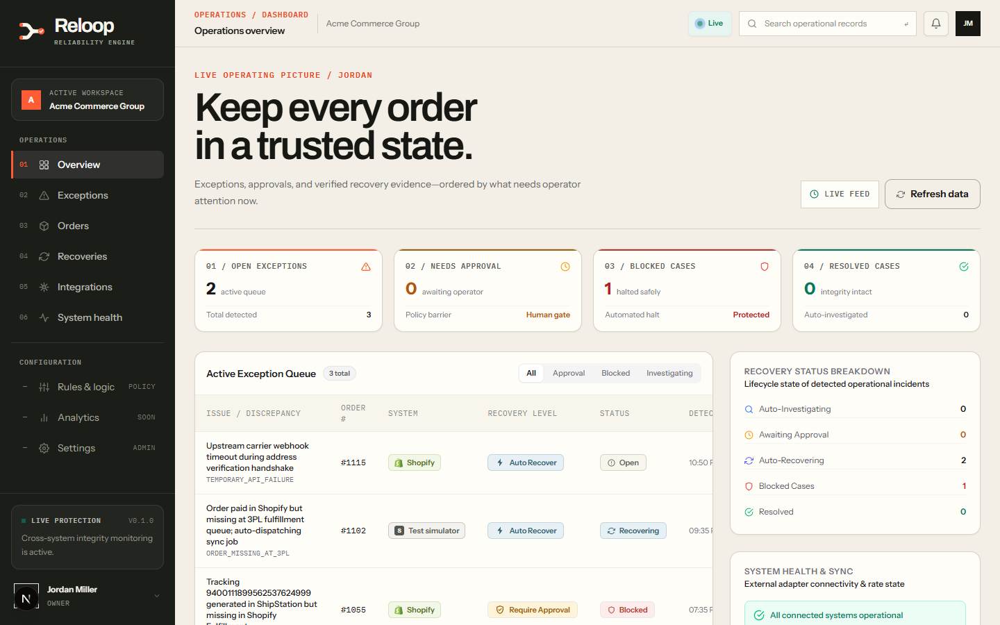
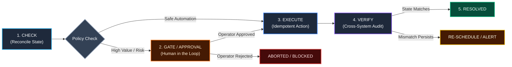
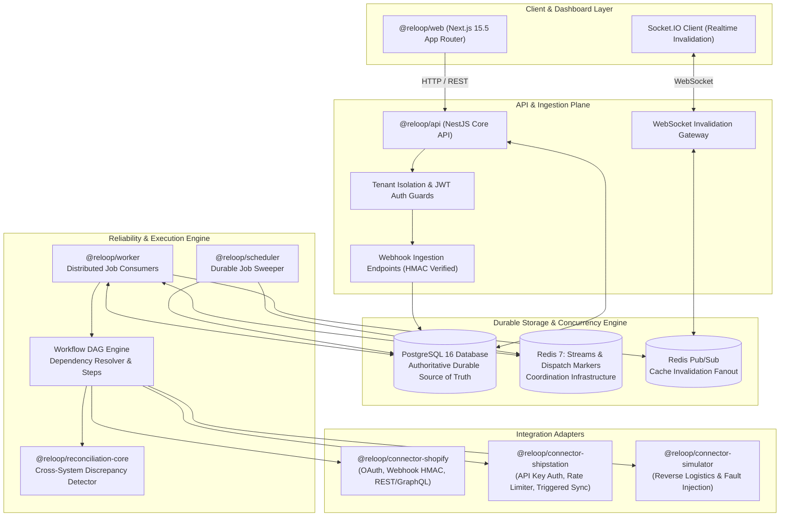
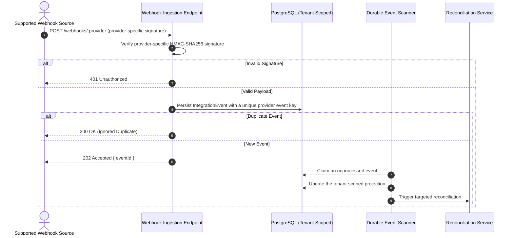
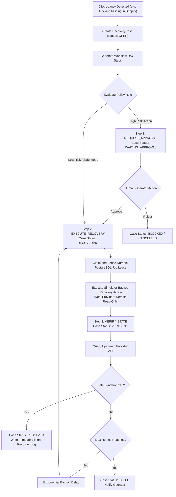
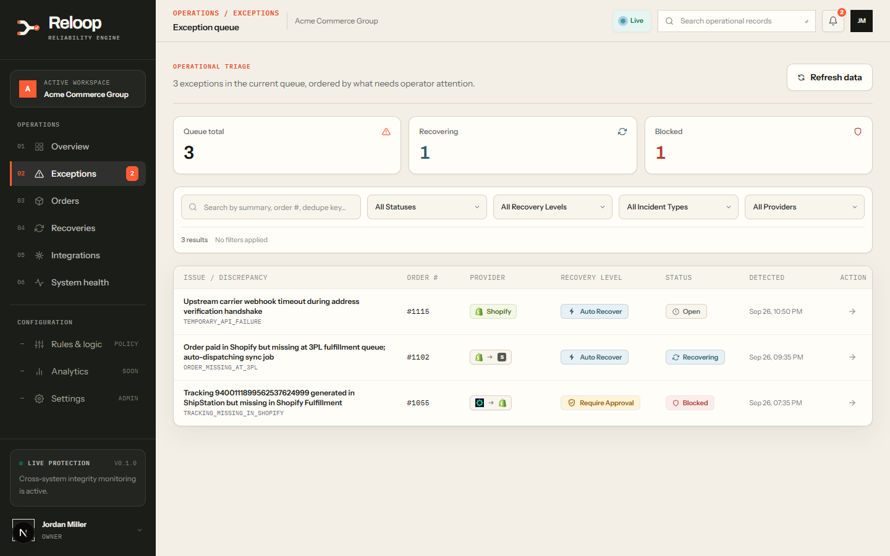
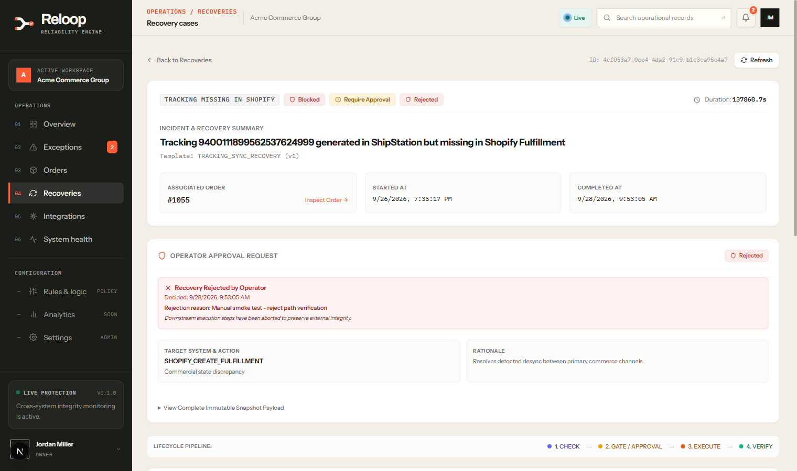
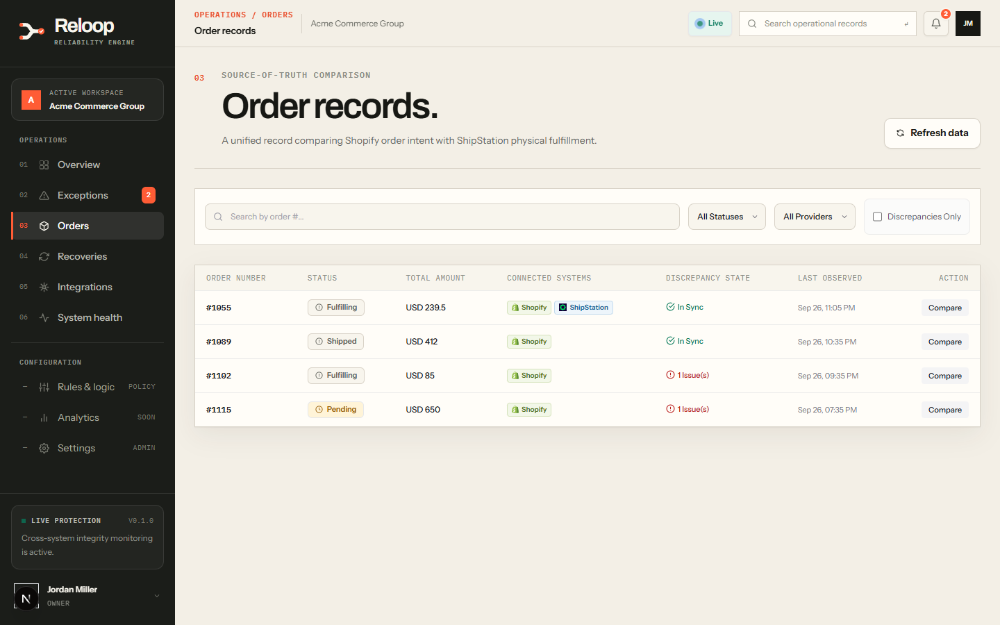

# Reloop: E-Commerce Reliability & Recovery Engine

[](https://www.typescriptlang.org/)
[](https://nextjs.org/)
[](https://nestjs.com/)
[](https://www.prisma.io/)
[](https://www.postgresql.org/)
[](https://redis.io/)
[](https://github.com/arsi505/Reloop/tree/v1.0.0)

> **Student portfolio project** — Reloop explores how multi-channel e-commerce discrepancies can be detected, reviewed, recovered safely, and independently verified. It was built to demonstrate reliable distributed-system design rather than to claim production SaaS readiness.

> **Core Operating Invariant:**
> `CHECK -> GATE / APPROVAL -> EXECUTE -> VERIFY -> RESOLVED`
> Reloop never mutates upstream state blindly, never assumes eventual consistency resolved an error, and never marks an incident resolved until independent cross-system verification confirms total agreement.

---

## At a Glance

- **Problem:** Shopify, ShipStation, and warehouse data can diverge when webhooks arrive late, retries fail, or upstream state changes independently.
- **Approach:** Reconcile provider state, turn mismatches into explicit recovery cases, apply approval gates to risky actions, and verify every outcome before resolution.
- **Built to demonstrate:** multi-tenant API design, durable job processing, idempotent workflows, PostgreSQL-backed leases, provider adapters, realtime UI invalidation, and auditability.
- **V1 safety boundary:** live provider integrations are read-only. Automated recovery writes are simulator-backed demonstrations, so no real Shopify or ShipStation records are changed.

## Run It Locally

```bash
git clone https://github.com/arsi505/Reloop.git
cd Reloop
npm install
cp .env.example .env
docker compose up -d
npm run db:migrate
```

Then seed the synthetic demo data and start the API and dashboard:

```bash
npx dotenv -e .env -e .env.example -- npx ts-node scripts/seed-rich-demo-data.ts
npm run dev --workspace=@reloop/api
npm run dev --workspace=@reloop/web
```

Open `http://localhost:3100/login` and sign in with `operator@reloop.test` / `Password123!`. The complete setup, optional services, and troubleshooting context are in [Detailed Local Setup](#7-detailed-local-setup).



---

## 1. Overview & Problem Statement

Modern multi-channel e-commerce is fundamentally distributed and asynchronous. Orders, fulfillment, shipment, and tracking data move across Shopify, ShipStation, and warehouse/3PL systems.

At integration boundaries, failure is inevitable:
- **Webhook Drops & Out-of-Order Delivery**: Shipments are created before fulfillment orders are acknowledged, or tracking numbers fail to register in the storefront.
- **Cascading Retries & Double Actions**: Naive retries during intermittent API timeouts generate duplicate shipments, double-refunds, or trigger upstream rate limits.
- **Silent Desynchronization**: A customer service agent cancels an order in Shopify while a 3PL worker is packing it on the warehouse floor; the parcel ships anyway.

**Reloop provides a dedicated reliability and recovery layer for multi-channel commerce.** It ingests authenticated provider events and triggered sync results, reconciles cross-system entities against a single operational truth, isolates discrepancies into explicit **Recovery Cases**, orchestrates multi-step **DAG Workflows**, halts hazardous actions behind **Human Operator Approval Gates**, and durably records every state transition in an append-only **Flight Recorder**.

### Key Engineering Decisions

- **PostgreSQL is authoritative:** recovery state, leases, audit records, and tenant data are durable relational records—not queue state.
- **Redis coordinates work:** Streams and Pub/Sub accelerate dispatch and realtime invalidation, but are intentionally not the source of truth.
- **Risk requires a human gate:** high-impact actions are paused for an authenticated operator rather than retried automatically.
- **Resolution requires evidence:** an action is not considered complete until a separate provider read verifies that the expected state now agrees.

---

## 2. Core Operational Workflow



---

## 3. System Architecture & Component Roles

Reloop enforces a clean separation of concerns between durable storage, distributed execution, and client visualization:

- **PostgreSQL = Durable Source of Truth**: All tenant models, external orders, integration events, recovery cases, workflows, approval gates, and flight recorder audit logs are stored durably with relational integrity.
- **Redis = Dispatch, Coordination & Realtime Infrastructure**: Provides Redis Streams for work distribution, short-lived dispatch-deduplication markers, and Pub/Sub for lightweight invalidation signals. Redis is **not** treated as durable state of record.
- **Scheduler = Durable Job Rediscovery**: Periodically sweeps PostgreSQL to discover eligible execution candidates, detect expired worker leases, and dispatch work into Redis Streams.
- **Worker = Claim, Lease, Execute, Verify**: Receives Redis Stream dispatches, atomically claims durable jobs in PostgreSQL, renews a PostgreSQL-backed lease with fencing checks, executes DAG steps idempotently, and independently verifies post-action consistency through authoritative adapter reads before writing final state to PostgreSQL. V1 recovery writes remain simulator-only.
- **Realtime Notifications = Invalidation Signals**: WebSockets (via Socket.IO) transmit lightweight cache invalidation signals; the browser refetches authoritative state from REST endpoints backed by PostgreSQL.



---

## 4. Operational Invariant Pipelines

### A. Webhook Ingestion & Deduplication Pipeline
Supported signed webhook sources can arrive unpredictably and may retransmit the same event. Reloop verifies provider-specific signatures and uses durable database uniqueness to make ingestion idempotent. Shopify and the simulator-backed adapter expose signed webhook paths in V1; ShipStation synchronization is triggered and does not use a native webhook path.



### B. Recovery Case & DAG Execution Pipeline
When a cross-system discrepancy is detected, Reloop initiates a controlled recovery workflow:



---

## 5. Operational UI Gallery

Reloop includes an operational web UI built with **Next.js 15.5 App Router**, **Tailwind CSS**, and **Socket.IO Realtime Invalidation**.

| Screen | Description | Reference Asset |
| :--- | :--- | :--- |
| **Operations Dashboard** (`/dashboard`) | Command center displaying open exceptions, pending human gates, blocked cases, and live system feed. | [`02-dashboard-overview.png`](docs/assets/screenshots/02-dashboard-overview.png) |
| **Exception Queue** (`/exceptions`) | Multi-channel incident queue with multi-facet filtering (status, recovery level, incident type, provider). | [`03-exceptions-queue.png`](docs/assets/screenshots/03-exceptions-queue.png) |
| **Recovery Detail & DAG View** (`/recoveries/[id]`) | DAG workflow visualization, interactive human approval gate with preview diff, and Flight Recorder audit trail. | [`04-recovery-detail.png`](docs/assets/screenshots/04-recovery-detail.png) |
| **Cross-System Orders** (`/orders`) | Order reconciliation view highlighting discrepancies across Shopify, ShipStation, and warehouse/3PL records represented by configured adapters. | [`05-orders-reconciliation.png`](docs/assets/screenshots/05-orders-reconciliation.png) |
| **Integrations Hub** (`/integrations`) | External adapter management, OAuth state, sync recency, safety guardrails (read-only mode enforcement). | [`06-integrations-hub.png`](docs/assets/screenshots/06-integrations-hub.png) |
| **System Operational Health** (`/health`) | Infrastructure observability, component connectivity (Postgres, Redis), and provider rate-limit telemetry. | [`07-system-health.png`](docs/assets/screenshots/07-system-health.png) |
| **Secure Authentication** (`/login`) | Tenant-isolated user authentication portal. | [`01-login-screen.png`](docs/assets/screenshots/01-login-screen.png) |

---

### Operations Dashboard Overview


### Exception Management Queue


### Recovery Case, Human Approval Gate & Flight Recorder


### Cross-System Order Reconciliation Table


---

## 6. Monorepo Structure

The project is structured as an npm monorepo with 14 cohesive, decoupled workspaces:

```
reloop/
├── apps/
│   ├── api/                    # NestJS Core API (Port 3101: REST, Webhooks, Auth, WebSockets)
│   ├── web/                    # Next.js 15.5 App Router Dashboard (Port 3100)
│   ├── worker/                 # Distributed Stream Worker Daemon
│   ├── scheduler/              # Cron Polling & Durable Job Sweeper
│   └── simulator/              # Reverse Logistics Simulation Server
├── packages/
│   ├── contracts/              # Shared DTOs, Enums, Interfaces & API Contracts
│   ├── database/               # Prisma Schema, Database Client & Migrations
│   ├── integration-sdk/        # Base Connector interfaces, rate-limiters, safe wrappers
│   ├── reconciliation-core/    # Discrepancy detection engine & comparison rules
│   └── workflow-core/          # Multi-step DAG orchestrator & state machine
└── connectors/
    ├── shopify/                # Shopify OAuth, REST/GraphQL clients, webhook verification
    ├── shipstation/            # ShipStation read-only REST adapter and triggered sync
    ├── simulator/              # Fault-injection engine & reverse logistics simulator
    └── generic-3pl/            # Generic warehouse/3PL contract and adapter direction
```

---

## 7. Detailed Local Setup

### Prerequisites
- **Node.js**: v20.x, v22.x, or v24 LTS
- **Docker & Docker Compose**: Docker Engine 24+ / Docker Desktop
- **npm**: v10+

### Step 1: Clone & Install Dependencies
```bash
git clone https://github.com/arsi505/Reloop.git
cd Reloop
npm install
```

### Step 2: Environment Configuration
Copy the template configuration:
```bash
cp .env.example .env
```
*(Ensure `DATABASE_URL` references host port `5433` and `REDIS_URL` references host port `6380` as configured in `docker-compose.yml`.)*

### Step 3: Start Infrastructure Services
Start the dedicated PostgreSQL 16 and Redis 7 containers:
```bash
docker compose up -d
```
Verify container health:
```bash
docker compose ps
```

### Step 4: Run Database Migrations
Apply database schema migrations:
```bash
npm run db:migrate
```

### Step 5: Seed Synthetic Demonstration Data (Optional Local Navigation)
Populate the database with synthetic demonstration data for UI inspection and navigation:
```bash
npx dotenv -e .env -e .env.example -- npx ts-node scripts/seed-rich-demo-data.ts
```

### Step 6: Start Applications
In separate terminal tabs (or background processes):
```bash
# Terminal 1: Core API Gateway (Port 3101)
npm run dev --workspace=@reloop/api

# Terminal 2: Web Dashboard (Port 3100)
npm run dev --workspace=@reloop/web

# Terminal 3: Reliability Worker Daemon
npm run dev --workspace=@reloop/worker

# Terminal 4: Durable Scheduler Sweeper
npm run dev --workspace=@reloop/scheduler

# Terminal 5 (Optional): Reverse Logistics Simulator
npm run dev --workspace=@reloop/simulator
```

### Demonstration Credentials
> [!NOTE]
> **LOCAL DEVELOPMENT / SYNTHETIC DATA ONLY**: These credentials access synthetic data generated by `scripts/seed-rich-demo-data.ts`. They are not for production use.
- **URL**: `http://localhost:3100/login`
- **Email**: `operator@reloop.test`
- **Password**: `Password123!`
- **Organization**: `Acme Commerce Group` (Role: `OWNER`)

---

## 8. Security & Tenancy Invariants

Reloop applies a multi-tenant security model with explicit tenant scoping and conservative recovery controls:

1. **Tenant Data Isolation**: Tenant-scoped domain entities carry `organizationId`; API guards and organization-scoped service queries protect access paths. Relevant domain identities and deduplication keys use organization-scoped uniqueness constraints. Global identity, membership, and execution-support models are not all tenant columns themselves.
2. **Short-Lived Access Tokens & Rotation**:
   - Access tokens: Stateless JWT signed with HS256, 15-minute expiration.
   - Refresh tokens: `HttpOnly`, `SameSite=Lax` cookies (`Secure` in production), single-use with cryptographic rotation and server-side revocation tables.
3. **Envelope Encryption for Third-Party Credentials**:
   - Upstream API keys, OAuth tokens, and secrets are encrypted at rest using AES-256-GCM with unique initialization vectors (`iv`) and authentication tags (`authTag`).
4. **Webhook Signature Verification & Deduplication**:
   - Shopify webhook requests are checked using Shopify's HMAC-SHA256/Base64 convention; simulator-backed webhook requests use their configured HMAC-SHA256/hex convention. Both comparisons are timing-safe.
   - Persisted provider event identifiers and deduplication constraints prevent repeated delivery from producing duplicate event records or effects. ShipStation has no native webhook ingestion path in V1.
5. **Human Operator Approval Gate**:
   - Configured high-impact simulator recovery steps cannot execute autonomously unless authorized by an authenticated operator with `ADMIN` or `OWNER` privileges. Real Shopify and ShipStation mutation paths remain disabled in V1.
6. **Dependency Security Audit**:
   - The documentation audit on 2026-09-27 recorded `npm audit` with **17 known advisories**: 1 low, 9 moderate, 7 high, and 0 critical. Dependency remediation is outside this documentation-only correction.

---

## 9. Verification & Empirical Benchmarks

### LOCAL DEVELOPMENT MACHINE BENCHMARK
> [!NOTE]
> The following throughput figures represent a **local development machine benchmark** run under controlled developer hardware conditions. They do not claim distributed cloud production capacity.

- **Sustained Throughput Repeatability Benchmark**:
  - Tested with a bounded 10,000-job workload repeated across three independent runs under identical configuration:
    - **Run 1:** 300.1 completed jobs/sec
    - **Run 2:** 339.1 completed jobs/sec
    - **Run 3:** 372.4 completed jobs/sec
    - **Median Throughput:** On the final three-run local benchmark, median completed throughput was **339.1 jobs/sec** (exceeding the >= 250 completed jobs/sec local target).
  - All three runs achieved:
    - 10,000 / 10,000 jobs completed
    - 0 duplicate business effects
    - 0 blocked jobs
    - 0 dead-lettered jobs
    - 0 unfinished jobs
- **Webhook Ingestion Capacity**:
  - 100 events/sec target load passed with 0 drops.
  - Saturated load test: When 150 events/sec offered load was applied, the local ingestion endpoint saturated at ~107.8 accepted events/sec without data corruption or memory exhaustion (150 events/sec offered load was not supported on single-node local configuration; it saturated gracefully).
- **Fault-Injection & Chaos Testing**:
  - Redis outage drill: PostgreSQL retained durable job state; restored dispatch completed with 0 duplicate effects.
  - Worker crash before execution: expired PostgreSQL leases and Redis pending-entry recovery allowed a safe retry. An ambiguous crash during execution was blocked instead of blindly retried.
  - Duplicate webhook drill: 19 repeated deliveries returned `ignored_duplicate`; one event row was retained and 0 duplicate business effects occurred.

### Automated Release Verification

| Gate | Recorded V1 release result |
| :--- | :--- |
| Root test suite | **PASS** — 46 suites, 482 tests, 0 failures |
| API E2E | **PASS** — 10 suites, 150 tests, 0 failures |
| Simulator E2E | **PASS** — 1 suite, 17 tests, 0 failures |
| ESLint | **PASS** — 0 errors; 183 non-blocking warnings remain |
| TypeScript typecheck | **PASS** |
| Production build | **PASS** |

The security audit matrix separately records **41/41 passing assertions** covering RBAC, CSRF, tenant isolation, webhook security, and configuration safeguards. These gates are reported separately because their test populations are not asserted to be mutually exclusive.

---

## 10. Known Limitations & V1 Non-Goals

### Known Limitations
- **Local Benchmark Evidence**: Throughput and stress measurements were conducted on local developer hardware; performance under distributed multi-region cloud topologies will depend on network latency and provisioned IOPS.
- **Single-Region Architecture**: The V1 architecture is designed for single-region deployments; active-active multi-region database replication is not implemented.
- **Real Provider Credentials**: Live read-only integration smoke testing against real Shopify storefronts and ShipStation accounts requires valid developer credentials and merchant account permissions.
- **Dependency Advisories**: The 2026-09-27 documentation audit recorded 17 `npm audit` advisories (1 low, 9 moderate, 7 high, 0 critical); this documentation-only correction does not change dependencies.
- **V1 Recovery Scope**: Automated recovery writes are simulator-backed demonstrations of order-discrepancy, fulfillment-synchronization, and tracking-update workflows. Real Shopify and ShipStation mutations are disabled; their implemented integration paths are read-only.
- **ShipStation Ingestion**: ShipStation has no native webhook ingestion path in V1. Its read-only synchronization is explicitly triggered.
- **Provider Sync Scheduling**: Reloop's scheduler rediscovers and dispatches durable internal jobs; V1 does not include an automatic periodic provider-sync cron.
- **Warehouse/3PL Breadth**: The generic warehouse/3PL connector is a contract and adapter direction, not a claim of universal live warehouse-platform support.

### V1 Non-Goals (Explicitly Out of Scope)
The following capabilities are deliberately outside the scope of Reloop V1:
- Automated financial refunds or payment gateway chargebacks
- Upstream order cancellations or automated returns/RMA processing
- Inventory demand forecasting or inventory replenishment
- Complete replacement of Warehouse Management Systems (WMS)
- Visual drag-and-drop workflow builders or arbitrary user script execution
- Custom organizational roles or dynamic permission builders
- Single Sign-On (SSO / SAML / Okta)
- Commercial billing, subscription management, or meter tracking
- AI / LLM autonomous decision agents
- Multi-region active-active distributed clusters
- Apache Kafka message brokers
- Kubernetes orchestration manifests

---

## 11. Technology Stack

- **Monorepo Management**: npm Workspaces
- **Backend Framework**: NestJS, Express, Socket.IO
- **Frontend Framework**: Next.js 15.5 (App Router), React 18, Tailwind CSS, custom SVG icon system
- **Database & Modeling**: PostgreSQL 16, Prisma ORM 6.19
- **Queue & Coordination**: Redis 7 Streams, IORedis, PostgreSQL lease/fencing state
- **Language & Runtime**: TypeScript 5.9, Node.js 20+
- **Security & Cryptography**: Argon2, Node Crypto (AES-256-GCM, HMAC-SHA256)
- **Containerization**: Docker, Docker Compose

---

## 12. Supporting Documentation

- [System Architecture Specification](docs/architecture.md): Topology, component responsibilities, and failure mode analysis.
- [Manual Acceptance Testing Runbook](docs/manual-acceptance-test.md): Human acceptance test protocol for Day 24 validation.
- [Release Checklist](docs/release-checklist.md): Pre-release milestone tracking and verification gates.
- [Reliability Benchmark](docs/reliability-benchmark.md): Reproducible local throughput, duplicate-delivery, outage, and crash-drill evidence.
- [Security Model](docs/security-model.md): Implemented tenant, authentication, webhook, and operational security controls.
- [Shopify Integration](docs/shopify-integration.md): OAuth, signed webhook, read-sync, and read-only safety boundaries.
- [ShipStation Integration](docs/shipstation-integration.md): API-key authentication, triggered read-sync, reconciliation, and write fences.
- [Portfolio & Engineering Notes](docs/portfolio-notes.md): Technical deep-dive and architectural rationale for interviews.

---

## Academic Context

Reloop is a student portfolio project focused on the engineering trade-offs behind safe recovery automation: designing for idempotency, making durable state explicit, handling uncertain external-system outcomes, and keeping human operators in control of risky changes. The implementation and benchmark results should be evaluated as V1, local-development evidence rather than claims of hosted production capacity.

---

## 13. License

This project is licensed under the MIT License - see the [LICENSE](LICENSE) file for details.
