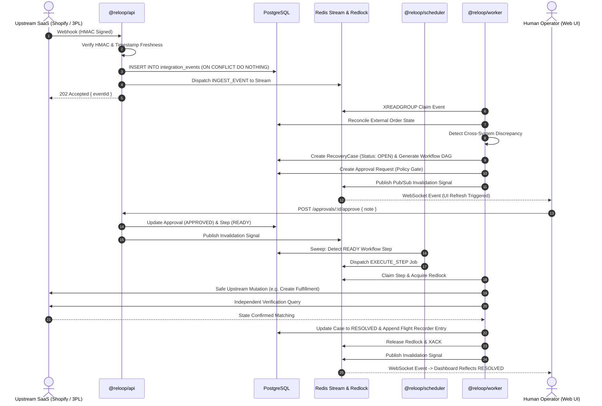

# Reloop System Architecture & Design Specification

This document details the architectural topology, component responsibilities, data durability boundaries, and concurrency semantics of the Reloop e-commerce reliability platform.

---

## 1. Architectural Philosophy & Durability Invariants

Reloop operates on a strict separation of concerns between durable persistence, distributed dispatch, execution leasing, and client notification:

```
┌────────────────────────────────────────────────────────────────────────┐
│                        POSTGRESQL 16 (PRISMA)                          │
│               AUTHORITATIVE DURABLE SOURCE OF TRUTH                    │
│   (Organizations, Orders, Incidents, DAG Workflows, Steps, Audit Logs) │
└───────────────────▲────────────────────────────────▲───────────────────┘
                    │                                │
            Durable Writes &                 Queries Eligible
            Authoritative State                 Stuck Jobs
                    │                                │
┌───────────────────┴────────────────┐   ┌───────────┴───────────────────┐
│           WORKER DAEMON            │   │       SCHEDULER DAEMON        │
│   Leases, Claims, Executes, Checks │   │   Periodic Sweep & Redispatch │
└───────────────────▲────────────────┘   └───────────┬───────────────────┘
                    │                                │
            Claims / Leases /                Dispatches Work
            Heartbeats / Ack                  Stream Entries
                    │                                │
┌───────────────────┴────────────────────────────────▼───────────────────┐
│                                REDIS 7                                 │
│        DISPATCH, COORDINATION & REALTIME INVALIDATION INFRASTRUCTURE   │
│            (Redis Streams, Redlock Distributed Mutex, Pub/Sub)         │
└────────────────────────────────────▲───────────────────────────────────┘
                                     │
                             Invalidation Events
                                     │
┌────────────────────────────────────┴───────────────────────────────────┐
│                            CORE API & WEB                              │
│       NestJS Gateway (REST/WS) & Next.js 15.5 Operational UI           │
└────────────────────────────────────────────────────────────────────────┘
```

### 1.1 PostgreSQL = Authoritative Durable Source of Truth
- **Single Source of Record:** All business entities (Organizations, Users, External Orders, Integration Events, Recovery Cases, DAG Workflows, Workflow Steps, Approvals, and Audit Logs) reside durably in PostgreSQL.
- **Transactional State Transitions:** State transitions are committed via ACID transactions. If an ephemeral worker or cache node crashes, no business state is lost.
- **Tenant Isolation:** Every table is partitioned logically by `organizationId`, with composite unique indexes preventing cross-tenant leakage at the schema level.

### 1.2 Redis = Dispatch, Coordination & Realtime Infrastructure
- **Non-Authoritative Role:** Redis is explicitly **not** used as durable cold storage. It is strictly infrastructure for:
  1. **Job Dispatch:** Redis Streams (`reloop:jobs:stream`) for decoupled work distribution.
  2. **Concurrency Coordination:** Redlock distributed leases (`reloop:lock:*`) to guarantee single-worker execution on any given order or recovery entity.
  3. **Realtime Signals:** Redis Pub/Sub (`reloop:events:channel`) for fanout invalidation messages.
- **Ephemeral Failure Safety:** If Redis is restarted or flushed, the system does not lose data; the Scheduler rediscovers eligible jobs from PostgreSQL and reconstructs the active work queue.

### 1.3 Scheduler = Durable Job Rediscovery
- The Scheduler is a lightweight supervisor running on a deterministic cadence.
- It queries PostgreSQL for pending workflows, stuck executions whose worker leases expired, and retry-waiting steps.
- It pushes eligible job IDs to Redis Streams. It never executes business mutations directly.

### 1.4 Worker = Claim, Lease, Execute, Verify
- Workers consume from Redis Streams via consumer groups (`XREADGROUP`).
- A worker atomically transitions a job to `CLAIMED` in PostgreSQL and establishes an active lease in Redis with periodic heartbeating.
- **Execution & Independent Verification:** The worker executes DAG actions idempotently, then queries upstream APIs to independently verify that target systems reflect the expected commercial state before marking the job `SUCCEEDED` in PostgreSQL.

### 1.5 Realtime Notifications = Invalidation Signals
- WebSockets (via Socket.IO) transmit **lightweight invalidation signals** (e.g., `{ entity: 'RECOVERY_CASE', id: '...', event: 'UPDATED' }`).
- Realtime payloads do not transport authoritative business payloads. When the browser receives an invalidation event, it refetches the authoritative data from the NestJS REST API, which queries PostgreSQL.

---

## 2. Monorepo Component Catalog

The Reloop monorepo is divided into 14 distinct workspaces across three directories:

```
reloop/
├── apps/
│   ├── api/                    # NestJS Core API Gateway (Port 3101)
│   ├── web/                    # Next.js 15.5 App Router Dashboard (Port 3100)
│   ├── worker/                 # Distributed Redis Streams Worker Daemon
│   └── scheduler/              # Cron Poller & Durable Job Sweeper
├── packages/
│   ├── contracts/              # Shared DTOs, Enums, Interfaces, API Contracts
│   ├── database/               # Prisma Schema, Migrations, Client & Repositories
│   ├── integration-sdk/        # Base Connector interfaces, rate limiters, token vaults
│   ├── reconciliation-core/    # Discrepancy detection engine & comparison rules
│   ├── workflow-core/          # Multi-step DAG orchestrator & state machine
│   ├── common/                 # Cryptography, telemetry, Redlock primitives
│   └── testing/                # Shared fixtures, test harnesses, mock factories
└── connectors/
    ├── connector-shopify/      # Shopify OAuth2, REST/GraphQL, Webhook HMAC adapter
    ├── connector-shipstation/  # ShipStation REST adapter, tracking sync, polling
    └── connector-simulator/    # Reverse logistics simulator & fault injection engine
```

### 2.1 Applications (`apps/`)

#### `@reloop/api` (Core API Gateway)
- **Framework:** NestJS 10.4 / Express.
- **Port:** `3101` (Default).
- **Responsibilities:**
  - REST endpoints for authentication, session management, operations queries, and human approval decisions.
  - Multi-tenant JWT authorization guards and HTTP-only cookie session handling.
  - Webhook ingestion endpoints with provider-specific HMAC signature validation and timestamp replay checks.
  - WebSocket gateway (`/realtime`) providing authenticated, tenant-scoped pub/sub invalidation fanout.
  - Global exception filters and structured operational request logging.

#### `@reloop/web` (Operational Dashboard)
- **Framework:** Next.js 15.5 (App Router) / React 18 / Tailwind CSS.
- **Port:** `3100` (Default).
- **Responsibilities:**
  - Modern B2B operational UI for logistics managers and operators.
  - Operations Command Center (`/dashboard`), Exception Queue (`/exceptions`), Cross-System Orders (`/orders`), Recoveries & Flight Recorder (`/recoveries`), Integrations Hub (`/integrations`), and System Health (`/health`).
  - Client-side single-flight token refresh mutex preventing concurrent refresh storms.
  - Two-browser live update synchronization via Socket.IO invalidation hooks.

#### `@reloop/worker` (Reliability & Execution Worker)
- **Responsibilities:**
  - Consumer loop processing work items dispatched via Redis Streams.
  - Redlock mutual exclusion across distributed worker nodes.
  - Multi-step DAG step execution with bounded exponential backoff retries.
  - Append-only Flight Recorder audit log persistence during every stage of recovery.
  - Heartbeat reporter maintaining worker liveness in PostgreSQL.

#### `@reloop/scheduler` (Durable Job Sweeper)
- **Responsibilities:**
  - Periodic background scheduler sweeping PostgreSQL for eligible execution candidates.
  - Detection of abandoned worker claims (reaping orphaned leases when worker heartbeats stall).
  - Enqueuing reconciliation evaluation jobs when new integration events arrive.

---

### 2.2 Core Packages (`packages/`)

#### `@reloop/contracts`
- Canonical data transfer objects (DTOs), API schemas, status enums, and event definitions shared identically between server, workers, and web frontend.

#### `@reloop/database`
- Centralized Prisma ORM configuration, schema definition (`schema.prisma`), database migration scripts, and transactional repository wrappers.

#### `@reloop/integration-sdk`
- Common interface contract for third-party connector adapters.
- Provides standard rate-limiting token buckets, exponential retry wrappers, secret envelope encryption helpers, and normalizer interfaces.

#### `@reloop/reconciliation-core`
- Pure, side-effect-free reconciliation engine that compares canonical order records across disparate providers (e.g. comparing Shopify order state against ShipStation shipment state).
- Generates typed discrepancies (e.g., `TRACKING_MISSING_IN_SHOPIFY`, `ORDER_MISSING_AT_3PL`, `TEMPORARY_API_FAILURE`).

#### `@reloop/workflow-core`
- Directed Acyclic Graph (DAG) template registry, cycle detection validation, step dependency resolver, and condition evaluation engine.

---

### 2.3 Connector Adapters (`connectors/`)

#### `@reloop/connector-shopify`
- Implements Shopify OAuth 2.0 flow, HMAC-SHA256 webhook signature verification, GraphQL/REST client wrappers, and automatic token refresh.

#### `@reloop/connector-shipstation`
- Implements ShipStation REST API integration, API key authentication, rate-limiting compliance, and order/shipment normalization.

#### `@reloop/connector-simulator`
- Realistic reverse-logistics simulator capable of firing simulated webhooks, mimicking warehouse dock scans, generating tracking events, and injecting controllable transient faults (504 timeouts, duplicate events).

#### `@reloop/connector-generic-3pl`
- Extensibility package defining standard webhook and polling contracts for custom third-party logistics integrations.

---

## 3. End-to-End Operational Lifecycle



---

## 4. Failure Modes & Self-Healing Properties

| Failure Scenario | System Behavior & Self-Healing Guarantee |
| :--- | :--- |
| **Worker process killed abruptly (`SIGKILL`)** | Worker heartbeat ceases in PostgreSQL. After lease expiration (15s default), the Scheduler sweeps the abandoned claim, resets step state, and redispatches it to the stream. Redlock TTL expires naturally. |
| **Ambiguous upstream timeout during mutation** | If a network timeout occurs while mutating an external system, the recovery step transitions to `BLOCKED`. It is **never** assumed succeeded or blindly retried without operator intervention, preventing duplicate commercial operations. |
| **Redis outage or flush** | PostgreSQL retains all workflow DAG definitions, step statuses, and attempt counts. When Redis recovers, the Scheduler scans PostgreSQL for active steps in `READY` or `RUNNING` (with expired leases) and pushes them back into Redis Streams. |
| **Duplicate webhook replay attack** | Database-level unique constraint on `dedup_hash` (`provider + eventId + payloadHash`) drops duplicates cleanly with HTTP 200/202, preventing redundant workflow creation. |
| **Two operators approve simultaneously** | Database optimistic concurrency locking / single-update conditional queries ensure exactly one operator's approval commits; the second operator receives an HTTP 409 Conflict error with immediate UI refresh. |
