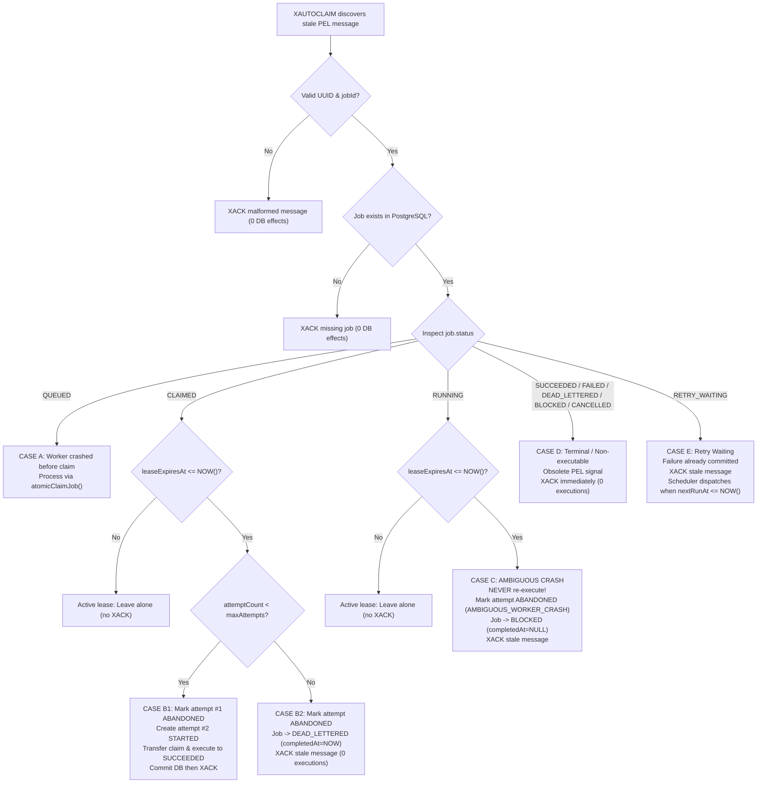

# Reloop Worker Crash, Stale PEL & Expired Lease Recovery

## 1. Architectural Purpose & Recovery Philosophy

In distributed e-commerce reliability platforms, worker instances may crash abruptly at any point in their lifecycle due to out-of-memory errors, VM preemptions, network partitions, or unexpected process termination.

When a worker crashes, two distributed artifacts are left behind:
1. **Unacknowledged Redis Messages in the Pending Entries List (PEL)**: Redis delivered the stream message to the worker's consumer group, but no `XACK` was ever issued.
2. **Orphaned PostgreSQL State & Expired Leases**: The job may have been `QUEUED`, `CLAIMED`, or actively `RUNNING`, with a lease timestamp that eventually expires.

### Fundamental Non-Negotiable Rules

1. **PostgreSQL is Always Authoritative**: Redis Streams PEL membership alone conveys **ZERO** execution authority. A worker discovering a pending message via `XAUTOCLAIM` must inspect the durable PostgreSQL state before touching the message or attempting execution.
2. **Safe Recovery vs. Ambiguous Crash Boundary**:
   - If the worker crashed **before** handler execution began (`CLAIMED` status), no external mutations occurred. It is provably safe to increment the attempt count and retry the job with another worker.
   - If the worker crashed **during** handler execution (`RUNNING` status), the outcome is fundamentally ambiguous. The crashed worker might have completed a non-idempotent mutation (e.g. charged a card or created a fulfillment) right before failing to report back. **A crashed `RUNNING` job is NEVER blindly re-executed.**
3. **Transaction-First Acknowledgment**: State transitions are durably committed in PostgreSQL **before** issuing `XACK` to Redis.

---

## 2. The 5 Recovery Scenarios

When a recovering worker scans the Redis PEL via `XAUTOCLAIM`, it evaluates the job's durable PostgreSQL record against five deterministic categories:



### Detailed Case Matrix

| Case | PostgreSQL Status | Lease Condition | Recovery Action | Target Status | Execution? | Redis XACK? |
|---|---|---|---|---|---|---|
| **A** | `QUEUED` | N/A | Normal atomic claim | `CLAIMED` $\rightarrow$ `RUNNING` $\rightarrow$ `SUCCEEDED` | Yes | Yes (after commit) |
| **B1** | `CLAIMED` | Expired (`<= NOW()`) & attempts remain | Mark prior attempt `ABANDONED`<br/>(`WORKER_LEASE_EXPIRED_BEFORE_EXECUTION`), increment `attemptCount`, create new `STARTED` attempt | `CLAIMED` $\rightarrow$ `RUNNING` $\rightarrow$ `SUCCEEDED` | Yes | Yes (after commit) |
| **B2** | `CLAIMED` | Expired (`<= NOW()`) & attempts exhausted | Mark prior attempt `ABANDONED`, set `completedAt = NOW()` | `DEAD_LETTERED` | **NO** | Yes (after commit) |
| **C** | `RUNNING` | Expired (`<= NOW()`) | Mark prior attempt `ABANDONED`<br/>(`AMBIGUOUS_WORKER_CRASH`), set `completedAt = NULL` | `BLOCKED` | **NO** | Yes (after commit) |
| **D** | `SUCCEEDED`, `FAILED`, `DEAD_LETTERED`, `BLOCKED`, `CANCELLED`, `WAITING_APPROVAL` | Any | Clear obsolete message from PEL | Unchanged | **NO** | Yes |
| **E** | `RETRY_WAITING` | Any | Stale dispatch from earlier attempt. Clear PEL; scheduler will dispatch fresh signal at `nextRunAt` | Unchanged | **NO** | Yes |
| **Protected** | `CLAIMED` or `RUNNING` | Active (`> NOW()`) | Worker is alive and renewing lease | Unchanged | **NO** | **NO** |

---

## 3. Redis Streams `XAUTOCLAIM` Engine

Stale message scanning is orchestrated by `StaleMessageRecoveryService` (`apps/worker/src/stale-message-recovery.ts`).

### Scanner Loop
- **Command**:
  ```text
  XAUTOCLAIM reloop:jobs:ready recovery-workers <recovering-worker-consumer> <minIdleMs> <cursor> COUNT <batchSize>
  ```
- **Cursor Tracking**: The recovery service maintains a stream cursor (`0-0` initial) to iterate across the consumer group PEL without starving pending messages.
- **Configurable Controls**:
  - `WORKER_RECOVERY_SCAN_INTERVAL_MS` (default: `5000ms`): Interval between background recovery sweeps.
  - `WORKER_PEL_MIN_IDLE_MS` (default: `20000ms`): Minimum idle time before an unacknowledged message qualifies as candidate stale.
  - `WORKER_RECOVERY_BATCH_SIZE` (default: `20`): Maximum entries inspected per scan pass.
- **Non-Overlapping Guard**: A concurrency flag (`isScanning`) prevents overlapping recovery passes within the same worker instance.

---

## 4. Multi-Worker Concurrency Protection

In a multi-worker cluster, multiple workers may run recovery scans concurrently and discover the same stale PEL message. Reloop guarantees safe serialization using row-level write locks (`FOR UPDATE`) inside atomic PostgreSQL transactions.

### Recovering Expired `CLAIMED` Jobs
```sql
SELECT id, organization_id, workflow_id, workflow_step_id, type, payload, attempt_count, max_attempts
FROM jobs
WHERE id = $jobId::uuid
  AND status = 'CLAIMED'::"JobStatus"
  AND lease_expires_at IS NOT NULL
  AND lease_expires_at <= NOW()
FOR UPDATE;
```
- Exactly **one** worker acquires the row lock while `status = 'CLAIMED'` and `lease_expires_at <= NOW()`.
- The winning worker increments `attemptCount`, extends `lease_expires_at`, marks the previous `JobAttempt` `ABANDONED`, and creates a new `JobAttempt` #2.
- The `UPDATE ... RETURNING` clause preserves authoritative relational columns (`workflow_id`, `workflow_step_id`), ensuring recovered workflow step jobs resume cleanly without failing the `WorkflowStepExecutor` validation gate.
- All competing workers block. Once the winner commits, competing workers evaluate the locked row, see `lease_expires_at > NOW()`, receive 0 rows, and safely abort without side effects.

### Recovering Expired `RUNNING` Jobs
```sql
SELECT id, attempt_count
FROM jobs
WHERE id = $jobId::uuid
  AND status = 'RUNNING'::"JobStatus"
  AND lease_expires_at IS NOT NULL
  AND lease_expires_at <= NOW()
FOR UPDATE;
```
- Exactly **one** worker locks the row and transitions `status` to `BLOCKED`, setting `completedAt = NULL` and marking the attempt `ABANDONED` with `AMBIGUOUS_WORKER_CRASH`.
- Competing workers see `status = 'BLOCKED'`, receive 0 rows, and abort cleanly.
- The winning worker then dispatches `XACK` to remove the message from the PEL.

---

### 4.1 Capacity Reservation & Shared Concurrency Budget

To prevent worker resource exhaustion and duplicate-risk:
1. **Shared Concurrency Budget**: Both normal stream consumers and recovery execution share the exact same `WORKER_CONCURRENCY` limit.
   $$\text{availableSlots} = \text{workerConcurrency} - (\text{activeJobs.size} + \text{inFlightCount} + \text{recoveryInFlightCount})$$
2. **Prior Slot Reservation**: The recovery engine reserves an execution slot (`reserveSlot()`) **before** calling `recoverExpiredClaimedJob`. If `availableSlots <= 0`, recovery is deferred and the job remains unmutated in PostgreSQL. This provably eliminates the failure mode where a worker acquires durable `CLAIMED` ownership but has no execution capacity, causing the job to sit stranded until its lease expires.
3. **Graceful Shutdown & Drain Protection**: When worker shutdown/drain begins (`isDraining = true`):
   - The recovery scan timer is cleared immediately.
   - Any new recovery scan passes return immediately (0 recoveries).
   - `reserveSlot()` rejects new reservations.
   - In-flight recovered executions in `activeJobs` continue under normal lease renewal until they finish or timeout.
   - The worker transitions to `OFFLINE` only after active jobs reach 0.

---

## 5. Verification & Live Demonstrations

### Automated Verification
The test suite `apps/worker/test/crash-recovery.spec.ts` exercises all 18 boundary conditions:
1. Discovery of abandoned PEL entries via `XAUTOCLAIM`.
2. Immediate `XACK` of malformed stream payloads without DB writes.
3. Immediate `XACK` of messages referencing deleted or non-existent jobs.
4. Safe reclamation of stale `QUEUED` messages via normal atomic claim.
5. Reclamation of expired `CLAIMED` jobs when attempts remain (attempt #1 `ABANDONED`, attempt #2 `SUCCEEDED`).
6. Dead-lettering of expired `CLAIMED` jobs when `maxAttempts` is reached (0 executions).
7. Safe fencing of expired `RUNNING` jobs into `BLOCKED` (attempt `ABANDONED` with `AMBIGUOUS_WORKER_CRASH`, `completedAt = NULL`, 0 executions).
8. Protection of active `CLAIMED` leases (`> NOW()`).
9. Protection of active `RUNNING` leases (`> NOW()`).
10. Stale `RETRY_WAITING` message cleanup without premature execution.
11. Cleanup of stale messages for terminal jobs (`SUCCEEDED`, `FAILED`, `DEAD_LETTERED`, `BLOCKED`, `CANCELLED`).
12. 3-worker concurrency race on expired `CLAIMED` job (deterministic 1-winner resolution).
13. 3-worker concurrency race on expired `RUNNING` job (deterministic 1-winner transition to `BLOCKED`).
14. Transaction ordering: PostgreSQL commit occurs before `XACK`, with idempotent replay safety.
15. Strict enforcement of `WORKER_CONCURRENCY` limit on recovered executable jobs (concurrency = 2 with 5 expired jobs).
16. Single shared `WORKER_CONCURRENCY` limit across mixed normal and recovery workloads.
17. Prevention of newly recovered `CLAIMED` job stranding in no-slot situations.
18. Graceful shutdown: recovery scans halted while active recovered execution drains cleanly to `OFFLINE`.

### Live Manual Demo Script
Run the interactive live demo script:
```bash
npx tsx scripts/manual-crash-demo.ts
```
Output confirms:
- **Scenario A**: Worker A crashes in `CLAIMED` $\rightarrow$ Worker B claims via `XAUTOCLAIM` $\rightarrow$ Attempt 1 `ABANDONED`, Attempt 2 `SUCCEEDED` $\rightarrow$ PEL clean.
- **Scenario B**: Worker A crashes in `RUNNING` $\rightarrow$ Worker C inspects via `XAUTOCLAIM` $\rightarrow$ Attempt 1 `ABANDONED` (`AMBIGUOUS_WORKER_CRASH`), Job `BLOCKED` (`completedAt = NULL`), 0 handler re-executions $\rightarrow$ PEL clean.
