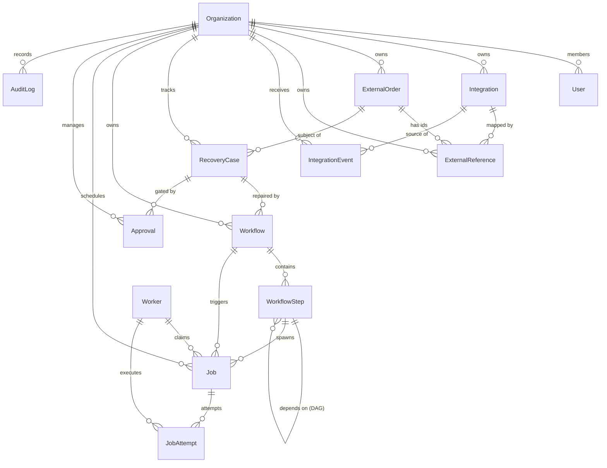

# Reloop Core Reliability Data Model

The Reloop data model provides the durable PostgreSQL foundation for distributed e-commerce recovery, reconciliation workflows, job scheduling, human approvals, and auditability.

PostgreSQL serves as the **authoritative durable source of truth** for all business states, recovery cases, workflows, and jobs. Redis functions strictly as downstream coordination infrastructure.

---

## 1. Architectural Concept Distinctions

Reloop maintains a strict separation of concerns across business issues, recovery strategies, execution mechanics, and external systems:

```
[External Systems] --> (IntegrationEvent)
                            |
                     (ExternalOrder) <---> (ExternalReference)
                            |
                     (RecoveryCase)  <--- The Business Problem
                            |
                       (Workflow)    <--- The Recovery Plan
                            |
                     (WorkflowStep)  <--- The Recovery Stage (DAG)
                            |
                          (Job)      <--- The Executable Work Item (Durable)
                            |
                       (JobAttempt)  <--- A Physical Execution Attempt
```

### 1.1 RecoveryCase vs. Workflow
- **RecoveryCase** represents **the business problem**. It answers: *What discrepancy was detected across which systems, and what is its operational severity?* (e.g., `SHIPPED_AT_3PL_UNFULFILLED_AT_SHOPIFY` with level `AUTO_RECOVER`). A case tracks status from `OPEN` to `RESOLVED` or `BLOCKED`.
- **Workflow** represents **the recovery plan** for a case. It defines a structured template of sequential or parallel stages designed to resolve the case. A single `RecoveryCase` may have multiple workflows over its lifecycle if a plan fails and must be replanned or restarted.

### 1.2 Workflow vs. WorkflowStep
- **Workflow** is the top-level orchestration container for a recovery plan, tracking aggregate progress (`PENDING`, `RUNNING`, `SUCCEEDED`, `FAILED`, `CANCELLED`).
- **WorkflowStep** represents an individual **stage** within a workflow (e.g., `VERIFY_3PL_INVENTORY`, `REQUEST_HUMAN_APPROVAL`, `SUBMIT_FULFILLMENT`). Steps support directed acyclic graph (DAG) dependency chains via `dependsOnStepId` self-relations, enabling parallel step execution.

### 1.3 WorkflowStep vs. Job
- **WorkflowStep** defines the *logical orchestration milestone* and input/output contracts.
- **Job** is the **durable executable unit of work** stored in PostgreSQL. A step enqueues one or more jobs to execute external API mutations or system checks. The job tracks execution parameters, scheduling windows (`nextRunAt`), leases (`leaseExpiresAt`), priorities, and retry limits.

### 1.4 Job vs. JobAttempt
- **Job** represents the durable work item and maintains its **stable idempotency identity** across all retries. The `idempotencyKey` is unique per organization and never changes during retries.
- **JobAttempt** represents a **single physical execution attempt** of a job. Each execution logs a distinct `attemptNumber`, duration, worker attribution, and categorized failure classification (`TRANSIENT`, `RATE_LIMITED`, `BUSINESS_ERROR`, etc.).

### 1.5 IntegrationEvent vs. AuditLog
- **IntegrationEvent** is an inbound **technical integration payload** (e.g., webhook from Shopify, polling result from 3PL). It enforces strict deduplication on `[integrationId, providerEventId]` to guarantee idempotent ingestion.
- **AuditLog** is an append-only **business audit trail** recording human decisions and high-level platform milestones (`CASE_DETECTED`, `APPROVAL_GRANTED`, `RECOVERY_EXECUTED`, `CASE_RESOLVED`). It contains no `updatedAt` column and preserves history even if actor users are deleted.

### 1.6 ExternalOrder vs. ExternalReference
- **ExternalOrder** is Reloop’s **normalized representation** of a customer order. It tracks high-level operational state (`READY_FOR_FULFILLMENT`, `SHIPPED`, etc.) and total amount using fixed-precision `Decimal` to eliminate floating-point discrepancies, while minimizing customer PII.
- **ExternalReference** maps that normalized order to specific provider IDs across connected platforms (e.g., Shopify Order GID `gid://shopify/Order/123`, ShipStation shipment ID, 3PL warehouse reference). It enforces uniqueness on `[organizationId, integrationId, resourceType, externalId]`.

### 1.7 Worker Infrastructure Scope
- **Worker** records active worker process instances in the cluster.
- Unlike business records, **Worker is not tenant-scoped**. Workers are shared infrastructure processes capable of leasing and processing jobs from any tenant. Tenant isolation is strictly enforced at the database query and service layer using `organizationId`.

### 1.8 Approval Purpose
- **Approval** manages human intervention gates for cases requiring operator sign-off (`REQUIRE_APPROVAL` policy). It captures the requested operator, deciding operator, rationale, and state transitions (`PENDING`, `APPROVED`, `REJECTED`, `EXPIRED`).

---

## 2. Entity Relationship Diagram



---

## 3. Database Invariants & Constraints

1. **Multi-Tenant Isolation**: All business records (`ExternalOrder`, `RecoveryCase`, `Workflow`, `Job`, etc.) are partitioned by `organizationId` with foreign key cascading deletion on tenant removal.
2. **Organization-Scoped Idempotency**: Jobs enforce `@@unique([organizationId, idempotencyKey])`, allowing identical external identifiers across separate tenants without collision.
3. **Deterministic Event Deduplication**: Inbound webhooks enforce `@@unique([integrationId, providerEventId])` when a provider event ID exists.
4. **Physical Attempt Uniqueness**: `@@unique([jobId, attemptNumber])` ensures strictly sequential and unambiguous attempt logs.
5. **Scheduler Query Optimization**: Compound index `@@index([status, nextRunAt])` enables sub-millisecond polling for `QUEUED` and ready `RETRY_WAITING` jobs.
6. **Immutable Audit Trail**: `AuditLog` omits `updatedAt` and uses `onDelete: SetNull` on `actorUserId` to guarantee business history permanence.
7. **Monetary Safety**: `ExternalOrder.totalAmount` utilizes PostgreSQL `DECIMAL(12, 2)` to prevent floating-point rounding bugs.
