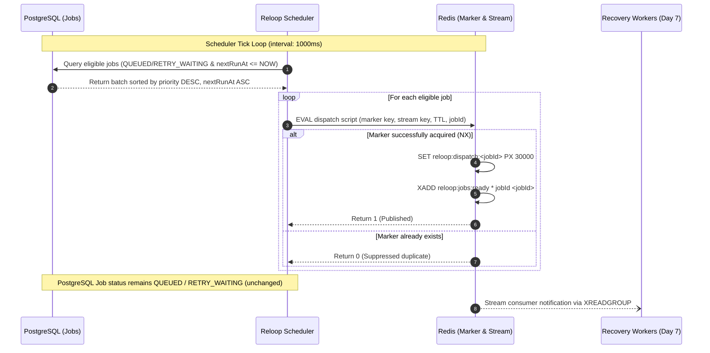

# Redis Streams Job Dispatch Scheduler Architecture

## 1. Overview & Operational Boundary

The Reloop Job Dispatch Scheduler forms the distributed execution boundary between durable PostgreSQL state and high-throughput Redis coordination:

$$\text{PostgreSQL (Durable Source of Truth)} \xrightarrow{\text{Job Scanner}} \text{Scheduler Tick} \xrightarrow{\text{Atomic Lua Script}} \text{Redis Stream (reloop:jobs:ready)}$$

### Core Tenets:
1. **PostgreSQL is the Sole Authority**: All business state, job metadata, payload, attempt counts, and idempotency constraints reside durably in PostgreSQL.
2. **Coordination without Data Duplication**: Redis Streams acts strictly as an ephemeral notification mechanism (`at-least-once` delivery notice).
3. **No BullMQ / Temporal / Kafka**: Direct Redis Streams integration using native commands (`XGROUP CREATE ... $ MKSTREAM`, `XADD`, `XINFO`, `XRANGE`).

---

## 2. Minimal Redis Message Payload

To guarantee zero customer data leakage into ephemeral queues and eliminate cache-state synchronization drift:

```
Stream Entry Fields:
["jobId", "<uuid>"]
```

- **NO** customer data, order line items, or PII.
- **NO** third-party API tokens, credentials, or secrets.
- **NO** JSON job payloads or step configurations.
- Workers retrieve the authoritative `Job` and associated `RecoveryCase` / `WorkflowStep` from PostgreSQL upon claiming.

---

## 3. Atomic Dispatch & Deduplication Protocol

Schedulers can run concurrently across multiple instances without double-publishing identical jobs during a dispatch window.

### Atomic Lua Script (`DISPATCH_LUA_SCRIPT`)
```lua
local markerAcquired = redis.call('SET', KEYS[1], '1', 'NX', 'PX', ARGV[1])
if markerAcquired then
  redis.call('XADD', KEYS[2], '*', 'jobId', ARGV[2])
  return 1
else
  return 0
end
```

- `KEYS[1]`: Short-lived dispatch marker key (`reloop:dispatch:<jobId>`).
- `KEYS[2]`: Stream key (`reloop:jobs:ready`).
- `ARGV[1]`: Marker TTL in milliseconds (`DISPATCH_MARKER_TTL_MS`, default `30000ms`).
- `ARGV[2]`: The canonical `jobId` UUID string.

### Invariants:
- If marker is set (`NX` succeeds), `XADD` executes atomically in the same Redis execution thread, returning `1` (published).
- If marker exists (job already dispatched within TTL), `SET` fails and `XADD` is suppressed, returning `0` (suppressed).
- If worker fails to claim the job before the TTL expires, the marker expires, allowing subsequent scheduler ticks to redispatch the job.

---

## 4. Database Non-Mutation on Dispatch

A critical architectural invariant in Reloop is that the Scheduler does **NOT** alter Job status during dispatch:
- `QUEUED` jobs remain `QUEUED`.
- `RETRY_WAITING` jobs remain `RETRY_WAITING`.
- `nextRunAt` and `attemptCount` remain completely unchanged.

Atomic claiming and transition to `CLAIMED` status is the exclusive responsibility of background workers (Day 7).

---

## 5. Sequence Diagram



---

## 6. Inspection & Verification Utilities

The scheduler package provides direct CLI tools for live stream inspection:

```bash
npm run --workspace=@reloop/scheduler queue:inspect
```

Outputs:
1. `XINFO STREAM <key>`: Stream length, radix tree metrics, consumer groups count.
2. `XINFO GROUPS <key>`: Consumer group names, active consumer counts, pending entry counts.
3. `XRANGE <key> - + COUNT 10`: Latest entries and minimal key-value payload inspection.