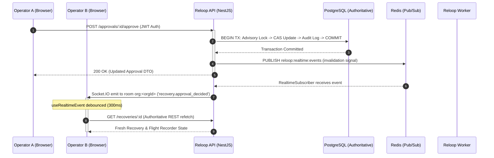

# Reloop Realtime Operations Architecture (Day 20)

## 1. Executive Summary & Core Philosophy

Reloop operates as an authoritative, high-integrity e-commerce reliability and recovery platform. In distributed operations, operators across multiple browser sessions require immediate awareness of system incidents, workflow progress, and team approval decisions.

### 1.1 Invalidation-Only Signal Model
A foundational architectural invariant in Reloop is that **WebSockets and Realtime Events are NEVER treated as a second source of truth**.

```
+-------------------------------------------------------------------------------+
|                             AUTHORITATIVE PRINCIPLE                           |
|                                                                               |
|  1. Durable PostgreSQL Transaction Commits FIRST                             |
|  2. Realtime Invalidation Signal Broadcasts AFTER commit                      |
|  3. Frontend Receives Invalidation and Refetches Authoritative REST API       |
+-------------------------------------------------------------------------------+
```

- **PostgreSQL is Authoritative:** Every mutation (approval decision, webhook event, case resolution, integration connection) commits durably to PostgreSQL inside row-locked transactions.
- **WebSocket Messages are Lightweight Invalidation Signals:** Events carry only minimal metadata: tenant ID, event type, entity ID, resource type, and timestamp.
- **Zero Client Mutations Over Sockets:** All operator decisions (Approve, Reject, Connect, Disconnect) are strictly dispatched via authenticated REST APIs (`POST /approvals/:id/approve`, etc.). Client socket frames attempting mutations are systematically discarded.
- **Zero Customer PII and Zero Secrets:** Under no circumstances are customer names, emails, addresses, raw tracking details, or credential fragments broadcast over realtime channels.

---

## 2. Realtime Event Topology & Data Flow



---

## 3. Redis Isolation: Streams vs Pub/Sub

Reloop maintains complete physical and semantic separation between durable job queues and ephemeral realtime notifications:

| Dimension | Durable Job Pipeline | Realtime Operational Fanout |
|---|---|---|
| **Mechanism** | Redis Streams (`XADD`, `XREADGROUP`, `XACK`) | Redis Pub/Sub (`PUBLISH`, `SUBSCRIBE`) |
| **Channel / Key** | `reloop:jobs:ready` | `reloop:realtime:events` |
| **Delivery Guarantee** | At-least-once, durable persistence, worker lease heartbeats | Best-effort, transient, ephemeral fanout |
| **Failure Mode** | Dead-letter queue, automatic worker failover, retry backoff | Graceful degrade to regular polling/refresh |
| **Isolation** | Completely decoupled from WebSockets | Dedicated subscriber client, isolated event loop |

---

## 4. WebSocket Security & Multi-Tenant Isolation

### 4.1 Handshake Authentication
1. **No URL Query Parameters:** Sockets require JWT access tokens in the handshake authentication payload:
   ```ts
   io(url, {
     path: '/socket.io',
     auth: { token: inMemoryAccessToken },
     transports: ['websocket', 'polling']
   });
   ```
2. **Signature & Expiration Verification:** `JwtService` verifies the token signature against `JWT_ACCESS_SECRET`. Expired or forged tokens immediately trigger `auth_error` and server disconnect.
3. **Authoritative Database Tenant Verification:** The gateway queries `prisma.organizationMember` to verify that the user is an active member of the token's `orgId`.

### 4.2 Room Binding & Tenant Isolation
Upon successful verification, the socket is bound **strictly to a server-derived room**:
```ts
const orgRoom = `org:${payload.orgId}`;
client.join(orgRoom);
```
- Sockets can only join their authenticated organization room.
- Tenant isolation is enforced by authenticated server-side room binding: sockets are bound exclusively to the authenticated organization room derived from the validated JWT claims. Messages emitted to tenant rooms are delivered strictly to clients authenticated for that tenant.
- Disconnecting sockets cleans up room membership automatically.

### 4.3 Transport Configuration & Session Stickiness
Reloop supports both WebSocket and HTTP long-polling fallback (`transports: ['websocket', 'polling']`).
- **Multi-Instance Deployments:** When HTTP long-polling fallback is enabled, multi-instance deployments behind a load balancer require session stickiness (session affinity / cookie routing) so the initial handshake and polling upgrade hit the same server instance.
- **Pure WebSocket Mode:** If clients are configured strictly with `transports: ['websocket']`, sticky sessions are not required at the transport layer since the connection upgrades over a single persistent TCP socket.
- **Durable Truth & Best-Effort Invalidation:** PostgreSQL remains the single durable truth; Redis Pub/Sub provides best-effort ephemeral invalidation; REST refetch restores authoritative state after any transport interruption.

---

## 5. Event Contracts & Schemas

Defined in `@reloop/contracts/realtime`:

```typescript
export type RealtimeEventType =
  | 'exception.created'
  | 'exception.updated'
  | 'recovery.created'
  | 'recovery.updated'
  | 'recovery.approval_requested'
  | 'recovery.approval_decided'
  | 'recovery.verification_updated'
  | 'integration.health_changed'
  | 'integration.sync_completed'
  | 'integration.sync_failed'
  | 'order.updated'
  | 'dashboard.changed';

export type RealtimeResourceType =
  | 'EXCEPTION'
  | 'RECOVERY'
  | 'APPROVAL'
  | 'INTEGRATION'
  | 'ORDER'
  | 'DASHBOARD';

export interface RealtimeNotification {
  organizationId: string;
  eventType: RealtimeEventType;
  resourceId?: string;
  resourceType?: RealtimeResourceType;
  orderId?: string;
  status?: string;
  provider?: string;
  changedAt: string;
  reason?: string;
}
```

### 5.1 Event Producers & Reserved Status Audit
- **Active Producers (Real durable transition + publisher):**
  - `exception.created`: Emitted by `TargetedReconciliationService` on newly persisted discrepancy cases.
  - `exception.updated`: Emitted by `TargetedReconciliationService` when existing active cases receive updated evidence.
  - `recovery.updated`: Emitted by `WorkerService` when workflow steps complete durably, and by `ApprovalsService` on decision transitions.
  - `recovery.approval_decided`: Emitted by `ApprovalsService` after approval/rejection transaction commits.
  - `integration.health_changed`: Emitted on connect, disconnect, and credential replacement in integration services.
  - `integration.sync_completed`: Emitted by `WorkerService` after sync jobs (`SHOPIFY_SYNC_ORDERS`, `SHIPSTATION_SYNC_SHIPMENTS`) commit durable config/references.
  - `integration.sync_failed`: Emitted by `WorkerService` on terminal sync job failure after durable state update.
  - `dashboard.changed`: Emitted across producers to trigger debounced metrics refresh.
- **Contract Reserved (Documented future contracts, ZERO frontend dependencies):**
  - `recovery.created`: Reserved for async creation by recovery router scanner. (Frontend does not depend on this).
  - `recovery.approval_requested`: Reserved for async approval step instantiation by scheduler coordinator. (Frontend does not depend on this).
  - `recovery.verification_updated`: Reserved for post-recovery external verification status updates. (Frontend does not depend on this).
  - `order.updated`: Reserved for direct external order streaming. (Frontend does not depend on this; Order Detail subscribes strictly to active correlation events).

---

## 6. Short-Lived Access JWT & Token-Expiry Enforcement

Reloop employs short-lived in-memory access JWTs (15-minute standard expiration) paired with HTTP-only refresh cookies. To prevent long-lived WebSockets from remaining authorized indefinitely:

1. **Server Expiration Scheduling:** During connection handshake, `RealtimeGateway` decodes `payload.exp`. If expired, connection is rejected immediately (`auth_error`). If valid, the gateway schedules a disconnect timer (`setTimeout`) matching the exact remaining token lifespan.
2. **Server-Initiated Disconnect:** Upon reaching `payload.exp`, the server emits `auth:expired` to the socket and terminates the connection (`client.disconnect(true)`).
3. **Client Proactive Token Refresh:** The frontend `RealtimeClient` intercepts `auth:expired` (and `auth_error`). It invokes `refreshAccessTokenSingleFlight()` to request a fresh in-memory access token via the HTTP-only refresh cookie, and reconnects using the new token without requiring a page reload.
4. **Zero URL Exposure & Cookie Isolation:** Access tokens are provided exclusively via Socket.IO handshake auth callbacks (`auth: (cb) => cb({ token: getAccessToken() })`), never query parameters. The HTTP-only refresh cookie is inaccessible to client JavaScript.

---

## 7. Targeted Detail View Realtime Invalidation

In addition to operational list screens, all detail routes incorporate targeted realtime subscriptions that trigger silent REST refetches without screen flicker, relying exclusively on active producers:

- **Exception Detail (`/exceptions/[id]`):** Subscribes to `exception.updated`, `recovery.updated`, and `recovery.approval_decided`. Refetches only when `resourceId` matches `exceptionId`, `detail.workflow.id`, or `detail.approval.id`.
- **Order Detail (`/orders/[id]`):** Subscribes to `exception.created`, `exception.updated`, `recovery.updated`, `recovery.approval_decided`, and `integration.sync_completed`. Refetches only when `notification.orderId === orderId`, `notification.resourceId === orderId`, or a related integration sync completes.
- **Recovery Detail / Flight Recorder (`/recoveries/[id]`):** Subscribes to `recovery.updated` and `recovery.approval_decided` matching the case ID. Dynamically updates the step execution timeline as background workers execute.
- **Integration Detail (`/integrations/[id]`):** Subscribes to `integration.health_changed`, `integration.sync_completed`, and `integration.sync_failed` matching the viewed integration ID.

---

## 8. Distributed Operations & Concurrency Semantics

### 8.1 Multi-Operator Approval Synchronization
When multiple operators (or an Operator and a Viewer) view the same pending recovery case simultaneously:
1. Operator A clicks **Approve** (submitting `POST /approvals/:id/approve` via REST).
2. The database commits the row lock and updates the approval status to `APPROVED`.
3. An invalidation signal (`recovery.approval_decided`) is published to Redis Pub/Sub.
4. Operator B's browser receives the signal, automatically closes any active decision dialog, refetches the authoritative case state, and renders an alert banner informing that the case was already decided. Operator B cannot execute duplicate mutations.

### 8.2 Worker-Originated Workflow Progress
1. Background worker picks up a recovery workflow step job from Redis Streams (`reloop:jobs:ready`).
2. Worker executes step handler, records output in PostgreSQL, and commits `WorkflowStep` to `SUCCEEDED`.
3. Worker publishes `recovery.updated` to Redis Pub/Sub (`reloop:realtime:events`).
4. API server `RealtimeSubscriber` receives the message and pushes to the tenant's socket room.
5. Operator's browser receives `recovery.updated`, refetches `/recoveries/:id`, and the Flight Recorder timeline advances from `RUNNING` to `SUCCEEDED` live without page reload.

### 8.3 Reconnection & REST Fallback Integrity
- **Temporary Disconnect:** If the network or API server restarts, the client status shifts to `● Reconnecting` or `● Offline`. Upon server availability, the socket reconnects with fresh credentials, shifts to `● Live`, and automatically refetches authoritative data.
- **Realtime Unavailable Fallback:** If WebSockets are blocked or unavailable, all core product operations remain fully functional over standard REST endpoints. Realtime is strictly an acceleration and awareness layer, never a single point of failure.

---

## 9. Frontend Integration & Lifecycle Management

### 9.1 Realtime Client Singleton (`realtimeClient`)
- Single persistent Socket.IO connection per browser tab.
- Reconnection with exponential backoff (1s to 10s with jitter).
- Synchronizes with `document.visibilityState`: when a background tab regains focus, any invalidations missed while backgrounded trigger an immediate fresh REST query.

### 9.2 React Context & Hook (`useRealtimeEvent`)
Components subscribe to events with automated burst coalescing:
```tsx
useRealtimeEvent(
  ['recovery.updated', 'recovery.approval_decided'],
  (event) => {
    fetchAuthoritativeState();
  },
  300 // 300ms debounce prevents API thrashing during rapid events
);
```

### 9.3 Top-Bar Live Status Indicator
The top header in `AppShell` displays the live socket engine state:
- **`CONNECTED`**: Emerald indicator with pulsing dot (`● Live`).
- **`RECONNECTING`**: Amber indicator with pinging dot (`● Reconnecting`).
- **`DISCONNECTED`**: Muted zinc indicator (`● Offline`).

### 9.4 Clean Navigation & Inactive Feature Handling
Unimplemented configuration items (`Rules & Logic`, `Analytics`, `Settings`) in `AppShell` do not navigate to dummy pages or display fake data. Instead, they render clean informational badges (`Enterprise`, `Coming Soon`, `Config`) and trigger modal notices explaining that custom rules and organization policies are configured via authenticated contracts.
