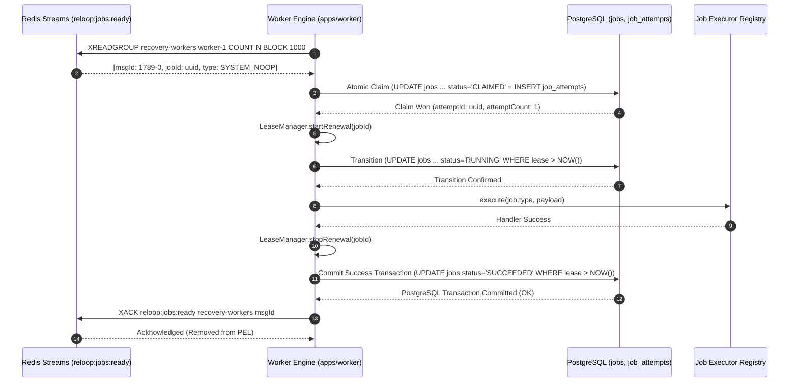

# Reloop Worker Engine: Distributed Execution, Atomic Claims & Leases

## 1. Architectural Purpose & Overview

The Reloop Worker Engine (`apps/worker`) is the distributed execution system responsible for processing reliability operations, reconciliation tasks, and verification workflows.

In high-throughput e-commerce systems, network partitions, webhook delivery spikes, and message retries inevitably generate duplicate signals. The Worker Engine guarantees **safe at-least-once message delivery with exactly-once execution safety**, ensuring that:
1. Two workers never execute the same job simultaneously.
2. A crashing worker's in-flight task can be safely reclaimed without data corruption.
3. Every execution attempt is durably recorded with structured timing, metadata, and error redaction.
4. Business state is committed durably in PostgreSQL **before** any Redis acknowledgement (`XACK`) is dispatched.

---

## 2. Message Consumption via Redis Streams

Workers consume dispatch signals from Redis Streams using consumer groups:
- **Stream Key**: `reloop:jobs:ready` (configurable via `JOB_STREAM_KEY`)
- **Consumer Group**: `recovery-workers` (configurable via `JOB_CONSUMER_GROUP`)
- **Consumer Name**: Unique per worker instance (e.g. `worker-prod-host1-pid1234-x8y9z`)

### Connection Architecture
Each worker process maintains two isolated Redis connections:
1. **Blocking Read Client (`readRedis`)**: Dedicated exclusively to blocking `XREADGROUP` commands (`BLOCK 100-2000ms`). By isolating this connection, blocking reads never stall critical commands. When stopping the worker, closing `readRedis` immediately interrupts any pending blocking call without hanging.
2. **Command Client (`commandRedis`)**: Handles `XACK`, consumer group verification (`XGROUP CREATE ... MKSTREAM`), ping checks, and metric queries.

### Payload Minimization
Redis Stream entries carry strictly minimal metadata:
```text
XADD reloop:jobs:ready * jobId <uuid> type <string>
```
No customer PII, secrets, order line items, or large JSON payloads ever enter Redis Streams. The stream serves purely as a real-time notification vehicle. The definitive source of truth is always PostgreSQL.

---

## 3. Atomic Conditional Claim Protocol

When a worker receives a stream notification, it queries PostgreSQL to attempt an atomic conditional claim.

### The Atomic Query
The claim is executed inside a single PostgreSQL interactive transaction using an atomic `UPDATE ... WHERE ... RETURNING` statement:

```sql
UPDATE jobs
SET
  status = 'CLAIMED'::"JobStatus",
  claimed_by_worker_id = $workerDbId::uuid,
  lease_expires_at = NOW() + ($leaseDurationMs || ' milliseconds')::interval,
  attempt_count = attempt_count + 1,
  updated_at = NOW()
WHERE
  id = $jobId::uuid
  AND status IN ('QUEUED'::"JobStatus", 'RETRY_WAITING'::"JobStatus")
  AND (next_run_at IS NULL OR next_run_at <= NOW())
RETURNING
  id,
  organization_id as "organizationId",
  type,
  payload,
  attempt_count as "attemptCount";
```

### Multi-Worker Race Safety
Because PostgreSQL rows are protected by row-level write locks during `UPDATE`, when $N$ concurrent workers race to claim the same job:
- **Exactly ONE worker** acquires the write lock, evaluates `status IN ('QUEUED', 'RETRY_WAITING')`, mutates the row to `RUNNING`, increments `attempt_count`, and receives `RETURNING` rows ($1$ row updated).
- **All other $(N - 1)$ workers** block until the winning transaction commits, after which they re-evaluate the `WHERE` clause. Since the job's status is now `RUNNING`, the `WHERE` condition fails ($0$ rows updated).
- The losing workers receive an empty result, gracefully acknowledge (`XACK`) the duplicate stream message, and remain idle without executing the job handler.

---

## 4. Single Attempt Binding (`JobAttempt`)

In the exact same interactive database transaction that claims the job:
```sql
INSERT INTO job_attempts (
  id,
  job_id,
  worker_id,
  attempt_number,
  status,
  started_at,
  created_at
)
VALUES (
  gen_random_uuid(),
  $jobId::uuid,
  $workerDbId::uuid,
  $job.attemptCount,
  'STARTED'::"JobAttemptStatus",
  NOW(),
  NOW()
)
RETURNING id;
```

This guarantees complete ACID atomicity:
- A job cannot be claimed without creating a corresponding `JobAttempt`.
- A `JobAttempt` cannot exist without an incremented `attemptCount` and acquired lease on the parent `Job`.

---

## 5. Lease Management & Automatic Renewal

To protect against worker process crashes, network freezes, or indefinite hangs, every claimed job is protected by a distributed lease:
- **Default Lease Duration**: 15,000ms (`JOB_LEASE_DURATION_MS`)
- **Renewal Cadence**: 5,000ms (`JOB_LEASE_RENEW_INTERVAL_MS`)

### Safety Rule
The system strictly enforces at startup that:
$$\text{JOB\_LEASE\_RENEW\_INTERVAL\_MS} < \text{JOB\_LEASE\_DURATION\_MS}$$

### Active Lease Renewal (`LeaseManager`)
While a job handler is actively executing, the worker's `LeaseManager` runs a periodic timer that calls `renewLease`:
```sql
UPDATE jobs
SET
  lease_expires_at = NOW() + ($leaseDurationMs || ' milliseconds')::interval,
  updated_at = NOW()
WHERE
  id = $jobId::uuid
  AND claimed_by_worker_id = $workerDbId::uuid
  AND status IN ('CLAIMED'::"JobStatus", 'RUNNING'::"JobStatus")
  AND lease_expires_at IS NOT NULL
  AND lease_expires_at > NOW();
```
If a worker loses ownership or its lease expires before renewal, the update returns $0$ rows. The `LeaseManager` records ownership loss, preventing an expired lease from being extended, transitioned to execution, or committed.

---

## 6. Post-Commit Acknowledgment Rule

Reloop enforces a non-negotiable invariant:
> **PostgreSQL durable state MUST be committed before Redis `XACK` is sent.**



If the worker crashes:
- **Before PostgreSQL Commit**: The job remains in `CLAIMED` or `RUNNING` status in PostgreSQL, but its lease will expire at `lease_expires_at`. The stream entry remains unacknowledged in the Redis Pending Entries List (PEL). No corrupted success status is written.
- **After PostgreSQL Commit, Before XACK**: The job is safely `SUCCEEDED` in PostgreSQL, preserving durable business integrity. The unacknowledged message remains pending in the Redis PEL until a future crash-recovery mechanism handles it (Day 7 does NOT implement `XAUTOCLAIM`, `XCLAIM`, or stale PEL recovery). If an independent duplicate or new stream signal for that same job appears, the worker re-checks PostgreSQL, sees `status == 'SUCCEEDED'`, does not re-execute, and immediately dispatches `XACK` on that duplicate signal.

---

## 7. Bounded Concurrency & In-Flight Tracking

Each worker enforces an upper bound on concurrent executions (`WORKER_CONCURRENCY`, default 5).
To prevent race conditions during asynchronous dispatch:
1. `inFlightCount` tracks stream messages currently between `XREADGROUP` and `atomicClaimJob`.
2. Available read slots are calculated as:
   $$\text{availableSlots} = \text{concurrency} - (\text{activeJobs.size} + \text{inFlightCount})$$
3. If `availableSlots <= 0`, the consumer loop pauses without querying Redis.
4. When a job claim is resolved (either won or discarded), `inFlightCount` decrements, guaranteeing that concurrent executions never exceed `WORKER_CONCURRENCY`.

---

## 8. Worker Heartbeat & Graceful Draining

### Heartbeat (`WorkerHeartbeat`)
Workers register in the `workers` table on startup:
- Status transitions: `ONLINE` $\rightarrow$ `BUSY` (when active jobs equal concurrency) $\rightarrow$ `DRAINING` (during shutdown) $\rightarrow$ `OFFLINE` (after full stop).
- `last_heartbeat_at` is refreshed periodically (`WORKER_HEARTBEAT_INTERVAL_MS`, default 5,000ms).

### Graceful Draining (`SIGINT` / `SIGTERM`)
1. On receiving a termination signal, the worker immediately updates its status to `DRAINING`.
2. The blocking read client (`readRedis`) is disconnected to prevent new job claims.
3. In-flight jobs are allowed up to `WORKER_SHUTDOWN_TIMEOUT_MS` (default 30,000ms) to finish cleanly.
4. All active lease renewal timers are cancelled.
5. The worker row is updated to `OFFLINE` with `stopped_at = NOW()`.
6. Command Redis client quits cleanly.

---

## 9. Day 7 Boundaries & Scope Freezing

- **Canonical Claim Lifecycle**: Jobs transition `QUEUED / RETRY_WAITING` $\rightarrow$ `CLAIMED` $\rightarrow$ `RUNNING` $\rightarrow$ `SUCCEEDED / FAILED`. `CLAIMED` indicates acquired PostgreSQL ownership, lease creation, and `STARTED` attempt creation prior to handler invocation.
- **Strict Scope of Atomic Claim**: Atomic claim accepts ONLY `QUEUED` and `RETRY_WAITING` (when `next_run_at IS NULL OR next_run_at <= NOW()`). Expired `CLAIMED` and expired `RUNNING` jobs are intentionally NOT claimed or recovered by worker claiming.
- **Strict Lease Validity**: An expired lease cannot be renewed, transitioned into execution, or used to finalize a result (`SUCCEEDED`, `FAILED`, `RETRY_WAITING`, or `DEAD_LETTERED`). Expired lease = no permission to execute or finalize.
- **No Stale PEL Recovery / No Expired Job Recovery**: Stale PEL recovery and expired lease recovery remain deferred to future reliability phases (`XAUTOCLAIM`/`XCLAIM` are not implemented).
- **Day 8 Retry Engine**: Handlers throwing retryable errors (`TRANSIENT`, `RATE_LIMITED`) now transition to `RETRY_WAITING` with exponential backoff and jitter, or `DEAD_LETTERED` when attempts are exhausted. Non-retryable errors transition immediately to `FAILED`. See [retry-engine.md](./retry-engine.md) for full design.
- **No External Business Logic**: Real recovery handlers and Shopify connectors remain deferred to subsequent milestones.
